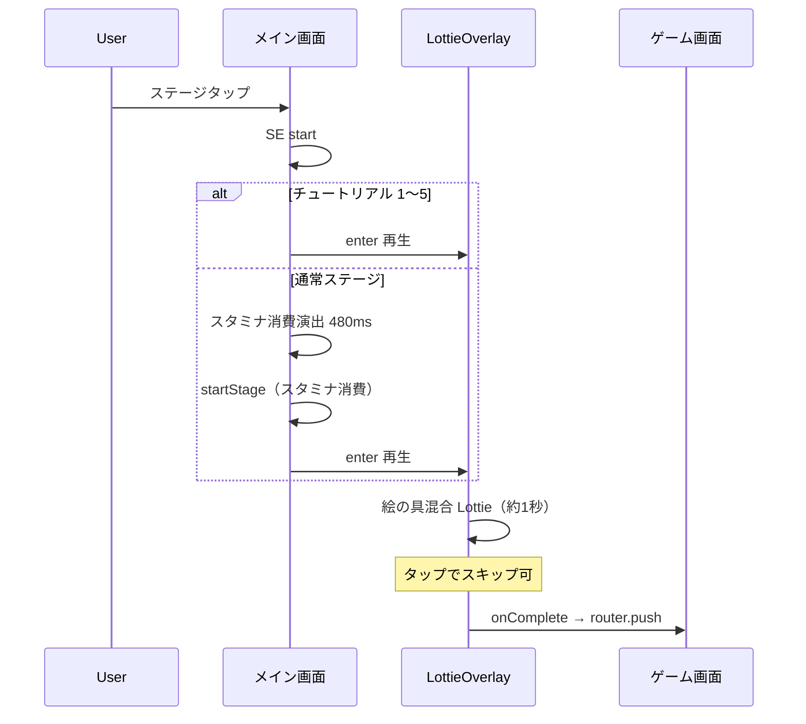

# Lottie 画面遷移演出 — 導入設計

ステージの **入場・クリア・退場** に Lottie アニメーションを使うための設計書です。

## 概要

| 演出 | ID | アセット | 再生タイミング | 状態 |
|------|-----|---------|----------------|------|
| 入場 | `enter` | `assets/lottie/enter.json` | メイン → ゲーム直前 | **実装済み** |
| クリア | `clear` | `assets/lottie/clear.json` | クリア確定 → タップでホーム | **実装済み**（iOS は既知バグあり） |
| 退場 | `exit` | `assets/lottie/exit.json` | 戻る / GO → メイン直前 | 未配線 |

RN 標準 `Animated` による盤面操作アニメーションとは別レイヤーです。  
画面遷移は **全画面オーバーレイで Lottie を再生し、完了後に `router.push` / `router.back`** します。

## 技術スタック

- **ライブラリ:** `lottie-react-native`（`npx expo install lottie-react-native`）
- **アセット形式:** `.json`（`.lottie` バイナリは未採用 — Metro 設定が増えるため）
- **カタログ:** `src/lottie/catalog.ts`（音声の `src/audio/catalog.ts` と同じパターン）

## アーキテクチャ

```
assets/lottie/*.json
       ↓ require
src/lottie/catalog.ts          … パス・設定の一元管理
       ↓
components/lottie/EnterLottieOverlay.tsx   … 入場（現行）
components/lottie/ClearLottieOverlay.tsx   … クリア（現行）
components/lottie/pending/AppLottiePlayer.tsx … iOS 修正版（未配線）
       ↓
app/index.tsx                  … 入場
app/game/[stageId].tsx         … クリア
```

> **iOS クリアで enter が見える問題:** [lottie-ios-clear-fix.md](./lottie-ios-clear-fix.md)

### ナビゲーション

ゲーム画面の Stack アニメーションは `animation: 'none'` にし、Lottie と二重にならないようにしています（`app/_layout.tsx`）。

---

## 入場演出（実装済み）

### フロー



### 続きから

スタミナ消費なしで、入場 Lottie のみ再生後に `?continue=1` で遷移します。

### コード上の状態

`app/index.tsx`:

- `entryLottie: { stageId, href } | null` — Lottie 表示中
- `enteringStageId` — スタミナ消費中のみ（Lottie とは別フェーズ）
- `enteringRef` — 二重タップ防止

---

## クリア演出（実装済み・iOS 制限あり）

`app/game/[stageId].tsx` で `ClearLottieOverlay` を表示。アニメ終了後「タップで続ける」→ `clearStage` + `router.back()`。

**iOS + Expo Go:** ネイティブのビューリサイクルにより enter がゴースト表示される。開発ビルド + 修正版への切り替えは [lottie-ios-clear-fix.md](./lottie-ios-clear-fix.md) を参照。

### 旧メモ（参考）

---

## 退場演出（今後の配線）

### 対象操作

- ヘッダー戻る（`onBack`）
- ゲームオーバー overlay 閉じ（`onGameOverDismiss`）

クリアは `clear` を使うため、`exit` は「中断・失敗」向けのトーンにすると差別化しやすいです。

### 想定フロー

1. ユーザーが戻る / GO 続ける
2. 進行中なら `persist`（既存）
3. `exit` Lottie 再生
4. `onComplete` → `router.back()`

---

## アセット制作ガイド（入場）

### コンセプト

「3色の絵の具が画面外から流れ込み、中央で混ざってステージへ入る」

### カラーリファレンス（CMY 系）

| 色 | hex | 用途 |
|----|-----|------|
| シアン | `#48a8c8` | 絵の具ブロブ |
| マゼンタ | `#c84878` | 絵の具ブロブ |
| 黄 | `#e8b818` | 絵の具ブロブ |
| 背景 | `#dbc9a8` | `Theme.bg` |

### AE 制作の注意

- **ループなし** — 最終フレームで自然に止まるか、フェードアウト
- **セーフエリア** — 画面中央付近に絵の具が集まるため、重要な絵は中央〜上部に
- **ファイルサイズ** — 目安 200KB 以下（入場1本）
- **表現** — ベクター中心。ブラー・勾配は軽めに（端末差を抑える）

---

## 設定

`src/lottie/catalog.ts` の `LOTTIE_CONFIG`:

| キー | 既定値 | 説明 |
|------|--------|------|
| `allowSkip` | `true` | タップでスキップ |
| `postDelayMs` | `80` | 終了後、遷移までの余白 |

---

## テスト観点（入場）

- [ ] チュートリアル: Lottie → ゲーム、スタミナ消費なし
- [ ] 通常: スタミナ消費 → Lottie → ゲーム（`?started=1`）
- [ ] 続きから: Lottie → ゲーム（`?continue=1`）
- [ ] スタミナ不足時: Lottie なし
- [ ] 演出中: ステージ一覧・設定が操作不可
- [ ] タップスキップで即遷移
- [ ] iOS / Android 実機で JSON が表示される

---

## 変更履歴

| 日付 | 内容 |
|------|------|
| 2026-06 | Lottie 導入、入場・クリア配線。iOS 修正手順を lottie-ios-clear-fix.md に分離 |
